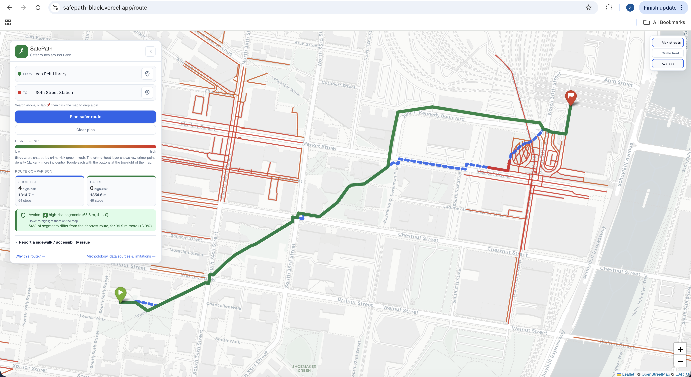

# SafePath

SafePath is a walking-route planner for the area around Penn. Give it a start and an
end point and it finds the safest way there, using Philadelphia crime history and
user-submitted sidewalk reports, instead of just the shortest path.

**Live demo:** [safepath-black.vercel.app](https://safepath-black.vercel.app)

Final project for a Penn summer program, built solo. It touches three parts of the
course: Pandas for the data prep, graphs for the routing, Flask for the web app.

## Screenshot

Shortest (blue) vs. safest (green) route, with the high-risk segments the safe route
avoided highlighted in red:



## Why it's interesting

Most routing apps just optimize for shortest distance. SafePath optimizes for safety
instead, and tries to show its work rather than hide it.

The core trick is running Dijkstra twice on the same graph: once weighted by plain
distance, once weighted by distance plus a crime-risk score built from about 107,000
historical incidents. Both routes get drawn on the map so you can see exactly where
they diverge. Two toggleable layers — a risk-colored street overlay and a raw
crime-density heatmap — let you see where the danger actually concentrates before you
even plan a trip.

The part I like best is that the app doesn't just pick a route and stay quiet about it.
Every result comes with a plain-language explanation: how many high-risk blocks got
avoided, how much "still risky" walking is left, and what kind of incidents (theft,
robbery, assault) were historically flagged nearby. That explanation shows up twice,
once in the sidebar and once in a popup you can dismiss.

Reports matter too. Submit a sidewalk-damage or poor-lighting report and the next route
computed actually avoids that block. It's a real POST that changes app behavior, not a
form that quietly disappears into a database.

## What it does

- Loads the OSM walking graph within about 3.5 km of Penn, cached as GraphML and a
  pickle for faster reloads.
- Buffers each street edge by 120 m and assigns nearby crime points to it with linear
  distance decay, so closer points count for more. This spreads risk across a few
  parallel streets instead of dumping it all on the single nearest one.
- Scores every edge: severity-weighted, distance-decayed crime sum, then
  percentile-rank normalization, then `safety_weight = length × (1 + 1.5 · risk_norm)`.
  Rank normalization keeps Dijkstra's full dynamic range and stops short crosswalk
  segments from getting penalized just for being short.
- Runs Dijkstra twice on the same graph, once on `length` for the shortest route (blue)
  and once on `safety_weight` for the safest route (green). Both get rendered on a
  Leaflet/folium map, along with the segments the safe route avoided (red) and the
  high-risk segments it still can't route around (amber dashed).
- Lets you search by name or pick a point on the map, backed by a local index of
  landmarks, intersections, and points of interest. No external geocoder, so it works
  offline.
- Opens a "Why this route?" popup on every computed route — you can dismiss it, and
  tell it not to show again. It mirrors the sidebar's route comparison and adds
  specific historical incident types, like "Thefts (19), Robbery No Firearm (2)",
  pulled from the same crime-to-edge aggregation that scores the route in the first
  place.
- Accepts reports of sidewalk damage, missing ADA ramps, poor lighting, or unsafe
  crossings. Reports get saved to SQLite and bump the nearest edge's weight, so a
  submitted report changes future routes.

## Run it

The repo ships with a pre-built graph and risk database (`data/walk.graphml`,
`data/walk.pkl`, `data/safepath.db`), so a fresh clone runs immediately:

```bash
python3 -m pip install -r requirements.txt
python3 app.py                   # http://127.0.0.1:5000/  (or: python3 -m flask --app app run)
```

Try `Market St Corridor` to `Mantua (35th & Haverford)` (or `Van Pelt Library`) to see
the two routes diverge and the risk layers light up. Then submit a `sidewalk_damage`
report on the blue line and re-route — the green (safest) line shifts off the reported
block.

To rebuild everything from scratch with your own crime data (see below), run:

```bash
python3 prep_data.py             # rebuilds data/walk.graphml + data/walk.pkl + data/safepath.db
```

### Crime data

Crime CSVs aren't bundled — they're large, and licensed data. Download yearly incident
CSVs from [OpenDataPhilly — Crime Incidents](https://opendataphilly.org/datasets/crime-incidents/)
and drop them in `data/` as `crime_<YEAR>.csv`. Expected columns (auto-mapped):
`point_x` (lng), `point_y` (lat), `text_general_code`, `dispatch_date`, `dc_key`.

If no CSV is present, `prep_data.py` falls back to about 20 synthetic points so the
pipeline still runs. An optional live source is the
[PHL Carto SQL API](https://phl.carto.com/api/v2/sql) (table `incidents_part1_part2`,
no key needed) — documented here, but not wired into the app.

## Self-checks

```bash
python3 prep_data.py    # H1 (normalization) + H4/H4b (buffer assignment) + H9 (intersection places)
python3 routing.py      # H2 (safety_weight formula) + H3 (divergence) + H6/H7 (hot segments)
python3 app.py --check  # H5 (divergence classification) + H8 (snap guard) + H10-H12 (search)
```
All `__main__` blocks use bare `assert`. No test framework.

## Project layout

```
final_project/
├── prep_data.py         # Pandas + Graph: CSV → edge_risk / crime_points / places → SQLite
├── routing.py            # Graph: shortest vs safest Dijkstra, report bumps, hot segments
├── app.py                 # Flask: GET / , POST /route /report, GET /search /about
├── templates/             # index.html (map + forms + explainer modal), about.html
├── static/                # style.css, app.js (layers, autocomplete, map picking, modal)
├── data/                  # walk.graphml / walk.pkl / safepath.db (committed) + *.csv (gitignored)
├── vercel.json             # Vercel Flask function config
└── requirements.txt
```

## Data sources & attribution

- **Crime incidents** — City of Philadelphia / Philadelphia Police Department, via
  [OpenDataPhilly](https://opendataphilly.org/datasets/crime-incidents/) and the
  [PHL Carto SQL API](https://phl.carto.com/api/v2/sql).
- **Walking network** — © OpenStreetMap contributors, via [OSMnx](https://osmnx.readthedocs.io/).
- **Sidewalk / ADA conditions** — user-submitted only; no open dataset used.
- **Map rendering** — [Folium](https://python-visualization.github.io/folium/) /
  [Leaflet](https://leafletjs.com), basemap tiles © [CARTO](https://carto.com/attribution).

## Limitations (read before trusting a route)

1. **Proxy, not prediction.** Historical crime density is not future risk.
2. **Snapshot, not real-time.** Crime data only updates when someone re-runs
   `prep_data.py` by hand; the Carto API is documented but not wired live. Routes
   themselves are computed fresh on every request, so a submitted report changes the
   very next route.
3. **Fixed area.** Only about 3.5 km around Penn.
4. **Anecdotal sidewalk data.** Reports are user-submitted, sparse, unverified.
5. **Simple model.** Distance-decayed weighting, single α, no time-of-day decomposition.
6. **Intersection double-counting.** The 120 m buffer overlaps at intersections,
   amplifying intersection risk *by design*.
7. **Length + weight only.** No turn penalties, signals, grade, or lighting.
8. **Severity weights are judgment calls**, not empirically derived.
9. **Report bump is a tuned constant.** A single report bumps one edge by
   `×(1 + 5.0 · severity)`. On dense urban grids a near-equivalent parallel street
   often exists, so a single report usually shifts the *node sequence* rather than the
   total length. Several reports along one block produce a clearly visible reroute.
10. **α = 1.5 is locked.** Riskiest edge = 2.5× true length; zero-crime edge = true length.
11. **Percentile normalization loses magnitude.** Risk is normalized by percentile rank,
    so the riskiest block and a merely-risky one end up the same rank-distance apart —
    the actual magnitude gets discarded. The p90 high-risk threshold is itself
    rank-based, so the two stay consistent with each other.
12. **No street-address search.** Place search is a local index of landmarks,
    intersections, and OSM points of interest, not an external geocoder, so it won't
    find an arbitrary house number.
13. **Reports don't persist on Vercel.** The hosted deployment's filesystem is
    read-only outside `/tmp`, so `/report` writes to a per-instance copy of the
    database that's wiped on the next cold start. Locally (`python3 app.py`), reports
    persist normally.
